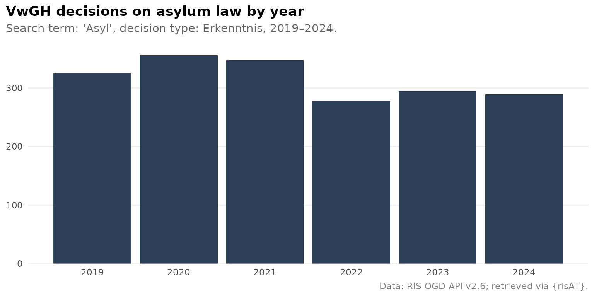

# Getting started with risAT

This vignette walks through the main features of {risAT} using concrete
examples. For a full parameter reference, see the [function
reference](https://werkstattcodes.github.io/risAT/reference/index.md).

{risAT} provides a tidyverse-friendly interface to the Austrian
[RIS](https://www.ris.bka.gv.at/) (Rechtsinformationssystem) Open
Government Data API v2.6. It covers the `/Judikatur` endpoint — case law
from all nine supported court applications — and is designed for
reproducible legal research.

## First search

The fastest way in is a court-specific wrapper. Each wrapper targets a
single court and provides typed, validated arguments. Let’s retrieve
Administrative Court (VwGH) decisions on housing law (*Baurecht*):

``` r

library(risAT)

results <- ris_search_vwgh(query = "Baurecht")
results
```

    #> # A tibble: 9,637 × 5
    #>    id                 document_type case_number decision_date vwgh_decision_type
    #>    <chr>              <chr>         <chr>       <chr>         <chr>             
    #>  1 JWT_2025050017_20… Text          Ro 2025/05… 2026-05-06    Beschluss         
    #>  2 JWR_2025050017_20… Rechtssatz    Ro 2025/05… 2026-05-06    Beschluss         
    #>  3 JWR_2025050017_20… Rechtssatz    Ro 2025/05… 2026-05-06    Beschluss         
    #>  4 JWT_2025070002_20… Text          Ro 2025/07… 2026-04-22    Erkenntnis        
    #>  5 JWT_2023050255_20… Text          Ra 2023/05… 2026-04-10    Beschluss         
    #>  6 JWR_2023050255_20… Rechtssatz    Ra 2023/05… 2026-04-10    Beschluss         
    #>  7 JWR_2023050255_20… Rechtssatz    Ra 2023/05… 2026-04-10    Beschluss         
    #>  8 JWT_2025050071_20… Text          Ra 2025/05… 2026-04-10    Beschluss         
    #>  9 JWR_2025050071_20… Rechtssatz    Ra 2025/05… 2026-04-10    Beschluss         
    #> 10 JWT_2025050145_20… Text          Ra 2025/05… 2026-03-27    Erkenntnis        
    #> # ℹ 9,627 more rows

All search functions return a tibble — one row per document. The most
frequently used columns are:

| Column          | Description                                         |
|-----------------|-----------------------------------------------------|
| `id`            | Unique RIS document identifier                      |
| `case_number`   | Business number (*Geschäftszahl*)                   |
| `decision_date` | Date of the decision                                |
| `document_type` | `Rechtssatz` or `Text` (full decision)              |
| `content_urls`  | List-column of download links                       |
| `app_metadata`  | List-column of court-specific and response metadata |

## Filtering results

All wrappers share a common set of filter arguments. Date ranges follow
ISO 8601 (`"YYYY-MM-DD"`), and `decision_type` accepts the German API
values and lowercase aliases.

``` r

results <- ris_search_vwgh(
  query              = "Asyl",
  decision_date_from = "2023-01-01",
  decision_date_to   = "2024-12-31",
  decision_type      = "Erkenntnis"
)

nrow(results)
```

    #> [1] 584

The `in_ris_since` argument is a convenient shortcut for recently
published documents:

``` r

recent <- ris_search_vwgh(in_ris_since = "one_month")
nrow(recent)
```

    #> [1] 855

## Decisions over time

Because results come back as a tidy tibble, downstream analysis with
{dplyr} and {ggplot2} is straightforward. Below we retrieve VwGH asylum
decisions from 2019 to 2024 and visualise the yearly count.

``` r

df_asyl <- ris_search_vwgh(
  query              = "Asyl",
  decision_date_from = "2019-01-01",
  decision_date_to   = "2024-12-31",
  decision_type      = "Erkenntnis"
)
```

``` r

library(dplyr)
library(ggplot2)
library(lubridate)

df_asyl |>
  mutate(year = year(as.Date(decision_date))) |>
  count(year) |>
  ggplot(aes(x = year, y = n)) +
  geom_col(fill = "#2E4057") +
  scale_x_continuous(breaks = 2019:2024) +
  scale_y_continuous(expand = expansion(mult = c(0, 0.05))) +
  labs(
    title    = "VwGH decisions on asylum law by year",
    subtitle = "Search term: 'Asyl', decision type: Erkenntnis, 2019–2024.",
    caption  = "Data: RIS OGD API v2.6; retrieved via {risAT}.",
    x = NULL, y = NULL
  ) +
  theme_minimal() +
  theme(
    plot.title          = element_text(face = "bold"),
    plot.title.position = "plot",
    plot.subtitle       = element_text(color = "grey40", margin = margin(b = 10)),
    plot.caption        = element_text(color = "grey50", size = rel(0.8)),
    panel.grid.major.x  = element_blank(),
    panel.grid.minor    = element_blank()
  )
```



## Court-specific wrappers

risAT provides wrappers for all nine Judikatur applications:

| Court | Function |
|----|----|
| VfGH (Constitutional Court) | [`ris_search_vfgh()`](https://werkstattcodes.github.io/risAT/reference/ris_search_vfgh.md) |
| VwGH (Administrative Court) | [`ris_search_vwgh()`](https://werkstattcodes.github.io/risAT/reference/ris_search_vwgh.md) |
| Justiz (OGH, OLG, LG, BG) | [`ris_search_justiz()`](https://werkstattcodes.github.io/risAT/reference/ris_search_justiz.md) |
| BVwG (Federal Administrative Court) | [`ris_search_bvwg()`](https://werkstattcodes.github.io/risAT/reference/ris_search_bvwg.md) |
| LVwG (State Administrative Courts) | [`ris_search_lvwg()`](https://werkstattcodes.github.io/risAT/reference/ris_search_lvwg.md) |
| DSK / DSB (Data Protection) | [`ris_search_dsk()`](https://werkstattcodes.github.io/risAT/reference/ris_search_dsk.md) |
| DOK (Disciplinary Bodies) | [`ris_search_dok()`](https://werkstattcodes.github.io/risAT/reference/ris_search_dok.md) |
| PVAK (Staff Representation) | [`ris_search_pvak()`](https://werkstattcodes.github.io/risAT/reference/ris_search_pvak.md) |
| GBK (Equal Treatment Commission) | [`ris_search_gbk()`](https://werkstattcodes.github.io/risAT/reference/ris_search_gbk.md) |

Some wrappers expose court-specific parameters.
[`ris_search_justiz()`](https://werkstattcodes.github.io/risAT/reference/ris_search_justiz.md)
lets you filter by court and legal area:

``` r

results_ogh <- ris_search_justiz(
  query      = "Schadenersatz",
  court      = "OGH",
  legal_area = "Zivilrecht"
)
nrow(results_ogh)
```

    #> [1] 9409

[`ris_search_lvwg()`](https://werkstattcodes.github.io/risAT/reference/ris_search_lvwg.md)
restricts results to a single state administrative court via
`federal_state`. English state names are accepted:

``` r

results_wien <- ris_search_lvwg(
  federal_state = "Vienna",       # also accepted: "Wien"
  decision_type = "Erkenntnis"
)
nrow(results_wien)
```

    #> [1] 9602

[`ris_search_gbk()`](https://werkstattcodes.github.io/risAT/reference/ris_search_gbk.md)
filters Equal Treatment Commission decisions by commission, senate, and
discrimination ground — English aliases are supported:

``` r

results_gbk <- ris_search_gbk(
  discrimination_ground = "gender",         # "Geschlecht"
  commission            = "private_sector"  # "Gleichbehandlungskommission"
)
nrow(results_gbk)
```

    #> [1] 284

## VfGH: constitutional court decisions

The VfGH wrapper defaults to legal principles (*Rechtssätze*) rather
than full decision texts — the most common use case for constitutional
court research. Toggle via `search_legal_principles` and
`search_decision_text`:

``` r

# Default: Rechtssätze (RS)
results_vfgh <- ris_search_vfgh(query = "Grundrecht")
nrow(results_vfgh)

# Request full decision texts instead
results_vfgh_et <- ris_search_vfgh(
  query                   = "Grundrecht",
  search_legal_principles = FALSE,
  search_decision_text    = TRUE
)
```

    #> [1] 1530

## Verifying results with echo

Setting `echo = TRUE` prints the search parameters and a direct link to
the same results on the official RIS website. This is useful for:

1.  **Verification** — open the URL in a browser and compare with the
    API results.
2.  **Sharing** — paste the URL to share a query with colleagues who
    don’t use R.
3.  **Exploration** — browse results on the RIS website before refining
    your query.

``` r

results <- ris_search_vwgh(
  query              = "Baurecht",
  decision_date_from = "2024-01-01",
  echo               = TRUE
)
```

The printed output shows the total hit count and a clickable RIS URL
that preserves all filter parameters.

## Working with list-columns

Two columns contain richer nested data.

### `content_urls` — download links

Each element of `content_urls` is a character vector of URLs pointing to
the document in different formats (XML, HTML, RTF, PDF):

``` r

results$content_urls[[1]]
```

    #> [1] "https://www.ris.bka.gv.at/Dokumente/Vwgh/JWT_2025050017_20260506J00/JWT_2025050017_20260506J00.xml" 
    #> [2] "https://www.ris.bka.gv.at/Dokumente/Vwgh/JWT_2025050017_20260506J00/JWT_2025050017_20260506J00.html"
    #> [3] "https://www.ris.bka.gv.at/Dokumente/Vwgh/JWT_2025050017_20260506J00/JWT_2025050017_20260506J00.rtf" 
    #> [4] "https://www.ris.bka.gv.at/Dokumente/Vwgh/JWT_2025050017_20260506J00/JWT_2025050017_20260506J00.pdf"

To extract all PDF URLs across results, filter by file extension:

``` r

library(purrr)

pdf_urls <- results |>
  mutate(
    pdf_url = map_chr(
      content_urls,
      \(x) {
        hit <- x[grepl("\\.pdf$", x, ignore.case = TRUE)]
        if (length(hit)) hit[[1]] else NA_character_
      }
    )
  ) |>
  filter(!is.na(pdf_url)) |>
  select(case_number, decision_date, pdf_url)

pdf_urls
```

    #> # A tibble: 9,637 × 3
    #>    case_number     decision_date pdf_url                                        
    #>    <chr>           <chr>         <chr>                                          
    #>  1 Ro 2025/05/0017 2026-05-06    https://www.ris.bka.gv.at/Dokumente/Vwgh/JWT_2…
    #>  2 Ro 2025/05/0017 2026-05-06    https://www.ris.bka.gv.at/Dokumente/Vwgh/JWR_2…
    #>  3 Ro 2025/05/0017 2026-05-06    https://www.ris.bka.gv.at/Dokumente/Vwgh/JWR_2…
    #>  4 Ro 2025/07/0002 2026-04-22    https://www.ris.bka.gv.at/Dokumente/Vwgh/JWT_2…
    #>  5 Ra 2023/05/0255 2026-04-10    https://www.ris.bka.gv.at/Dokumente/Vwgh/JWT_2…
    #>  6 Ra 2023/05/0255 2026-04-10    https://www.ris.bka.gv.at/Dokumente/Vwgh/JWR_2…
    #>  7 Ra 2023/05/0255 2026-04-10    https://www.ris.bka.gv.at/Dokumente/Vwgh/JWR_2…
    #>  8 Ra 2025/05/0071 2026-04-10    https://www.ris.bka.gv.at/Dokumente/Vwgh/JWT_2…
    #>  9 Ra 2025/05/0071 2026-04-10    https://www.ris.bka.gv.at/Dokumente/Vwgh/JWR_2…
    #> 10 Ra 2025/05/0145 2026-03-27    https://www.ris.bka.gv.at/Dokumente/Vwgh/JWT_2…
    #> # ℹ 9,627 more rows

### `app_metadata` — court-specific fields and response context

Court-specific fields and pagination context are nested in
`app_metadata`. Use
[`tidyr::unnest_wider()`](https://tidyr.tidyverse.org/reference/unnest_wider.html)
to bring them to the top level:

``` r

library(tidyr)

results |>
  select(id, case_number, app_metadata) |>
  unnest_wider(app_metadata) |>
  glimpse()
```

    #> Rows: 9,637
    #> Columns: 6
    #> $ id          <chr> "JWT_2025050017_20260506J00", "JWR_2025050017_20260506J02"…
    #> $ case_number <chr> "Ro 2025/05/0017", "Ro 2025/05/0017", "Ro 2025/05/0017", "…
    #> $ response    <list> [NA, 9637, 1, 100], [NA, 9637, 1, 100], [NA, 9637, 1, 100…
    #> $ technisch   <list> ["JWT_2025050017_20260506J00", "Vwgh", "Verwaltungsgerich…
    #> $ allgemein   <list> ["2026-06-02", "2026-06-02", "https://www.ris.bka.gv.at/D…
    #> $ request     <list> ["/Judikatur", "Vwgh", 1, "OneHundred", "https://www.ris.…

The `response` sub-list contains pagination context (total hits, page
number) and `request` records the exact API parameters sent:

``` r

# Total hits reported by the API
results$app_metadata[[1]]$response$hits

# Page context
results$app_metadata[[1]]$response$page_number
results$app_metadata[[1]]$response$page_size
```

    #> 9637
    #> 1
    #> 100

## The two-step pattern

Under the hood every wrapper calls two lower-level functions:

1.  [`ris_req_case_law()`](https://werkstattcodes.github.io/risAT/reference/ris_req_case_law.md)
    — builds an `httr2` request object (no network call).
2.  [`ris_perform_case_law()`](https://werkstattcodes.github.io/risAT/reference/ris_perform_case_law.md)
    — executes the request with automatic pagination.

Use these directly for more control — to inspect the URL before sending,
or to target application codes not covered by a named wrapper:

``` r

# Build — no network call yet
req <- ris_req_case_law(
  application = "Vwgh",
  query       = "Baurecht"
)

# Inspect the URL before sending
req$url

# Execute — fetches all pages automatically
results <- ris_perform_case_law(req)
nrow(results)
```

    #> https://data.bka.gv.at/ris/api/v2.6/Judikatur?Applikation=Vwgh&Suchworte=Baurecht&SortierungSortDirection=Descending&SortierungSortedByColumn=Datum&DokumenttypSucheInEntscheidungstexten=true&DokumenttypSucheInRechtssaetzen=true&Seitennummer=1&DokumenteProSeite=OneHundred
