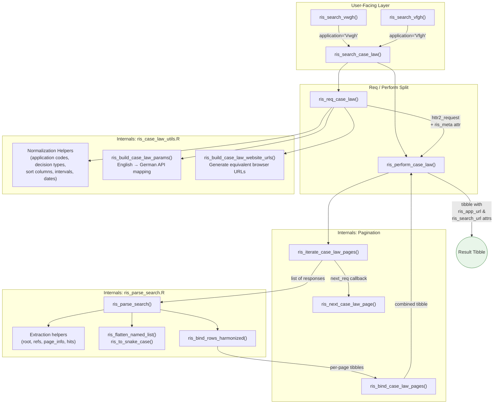
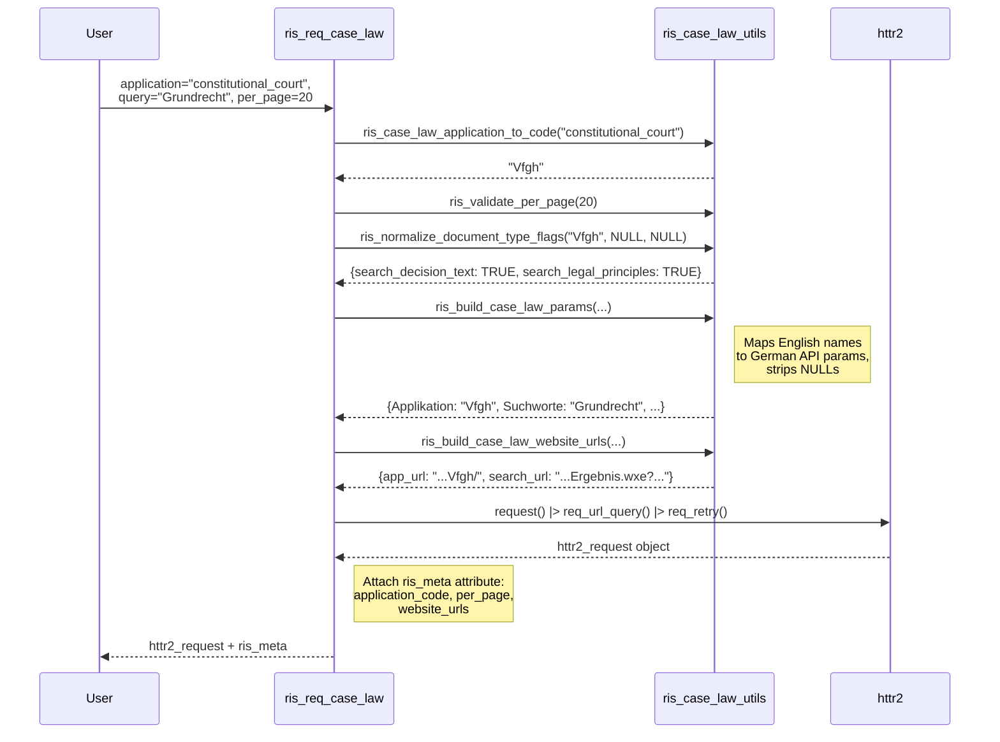
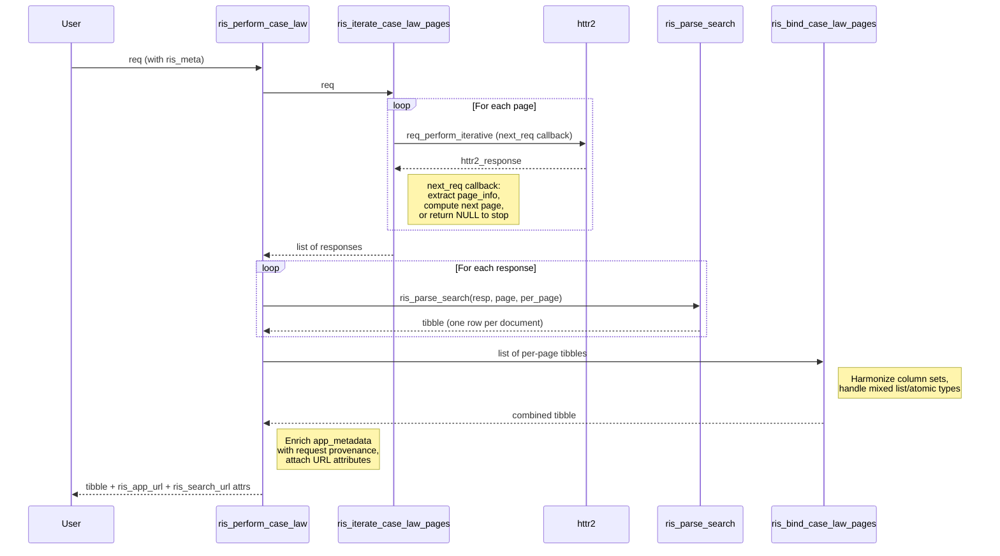

# Case Law Search System Architecture

## Overview

The risAT package provides an R interface to the Austrian RIS (Rechtsinformationssystem) OGD REST API v2.6, specifically the `/Judikatur` (case law) endpoint. The system translates user-friendly English parameters into the German-language API query format, handles multi-page result pagination, and parses deeply nested JSON responses into tidy tibbles.

The architecture follows httr2's **two-step req/perform pattern**: request construction is separated from execution so users can inspect, modify, or dry-run requests before hitting the network. Court-specific convenience wrappers (VfGH, VwGH) layer on top with sensible defaults.

## Architecture Diagram

## Components

### 1. Court-Specific Wrappers

**Purpose**: Provide a clean, focused interface for the two most common courts by pre-filling `application` and setting court-appropriate defaults.

**Locations**: `R/ris_search_vwgh.R`, `R/ris_search_vfgh.R`

**Key Functions**:
- `ris_search_vwgh()` — Hardcodes `application = "Vwgh"`, defaults both `search_decision_text` and `search_legal_principles` to `TRUE`
- `ris_search_vfgh()` — Hardcodes `application = "Vfgh"`, defaults `search_decision_text = FALSE` and `search_legal_principles = TRUE` (aligned with the official VfGH RIS handbook, which recommends searching Rechtssaetze by default)

**Interactions**: Both delegate entirely to `ris_search_case_law()`. They omit parameters only relevant to other applications (e.g. `court`, `legal_area`, `federal_state`).

### 2. Generic Search Wrapper

**Purpose**: One-call convenience function that combines request building and execution.

**Location**: `R/ris_search_case_law.R`

**Key Function**:
- `ris_search_case_law()` — Accepts all 33 search parameters, calls `ris_req_case_law()` then `ris_perform_case_law()`

**Interactions**: Pure pass-through. All validation and normalization happens in the functions it calls.

### 3. Request Builder

**Purpose**: Construct an `httr2_request` object without executing it. This is the entry point for the req/perform pattern.

**Location**: `R/ris_req_case_law.R`

**Key Function**:
- `ris_req_case_law()` — The most complex exported function. Orchestrates four steps:
  1. Validate and normalize inputs (application code, per_page, decision_type, sort_by, document type flags)
  2. Build the API query parameter list via `ris_build_case_law_params()`
  3. Build equivalent RIS website URLs via `ris_build_case_law_website_urls()`
  4. Construct the `httr2_request` and attach an `"ris_meta"` attribute

**The `ris_meta` attribute**: This custom attribute on the httr2 request object is the bridge between request building and execution. It carries:
- `application_code` — Canonical RIS code (e.g. `"Vfgh"`)
- `per_page` — Integer page size
- `website_urls` — List with `app_url` and `search_url` for the RIS website

### 4. Request Executor

**Purpose**: Execute an `httr2_request`, handle pagination across all result pages, parse each page, and return a single combined tibble.

**Location**: `R/ris_perform_case_law.R`

**Key Functions**:
- `ris_perform_case_law()` — The main orchestrator for execution. Steps:
  1. Extract `ris_meta` from the request (error if missing)
  2. Optionally echo RIS website URLs
  3. Fetch all pages via `ris_iterate_case_law_pages()`
  4. Parse each page via `ris_parse_search()`
  5. Combine pages via `ris_bind_case_law_pages()`
  6. Enrich `app_metadata` with request provenance
  7. Attach `ris_app_url` and `ris_search_url` as tibble attributes

**Pagination helpers** (internal, same file):
- `ris_iterate_case_law_pages()` — Drives `httr2::req_perform_iterative()` with a `next_req` callback that inspects each response for more pages
- `ris_next_case_law_page()` — Calculates next page number from `pageNumber`, `pageSize`, and total hit count; returns `NULL` when done
- `ris_bind_case_law_pages()` — Row-binds page tibbles, handling the case where different pages return different column sets or mixed list/atomic types

### 5. Response Parser

**Purpose**: Parse a single RIS API JSON response into a tidy tibble row-per-document.

**Location**: `R/ris_parse_search.R`

**Key Functions**:
- `ris_parse_search()` — Accepts an `httr2_response` or pre-decoded list. Extracts document references, page metadata, and converts each reference to a tibble row
- `ris_extract_root()` — Unwraps `OgdSearchResult` envelope
- `ris_stop_on_api_error()` — Checks for and raises API-level errors
- `ris_extract_document_references()` — Handles multiple JSON shapes for the document list
- `ris_extract_page_info()` — Extracts `pageNumber` and `pageSize` with multiple key fallbacks (`pageNumber`, `PageNumber`, `@pageNumber`)
- `ris_extract_hits_count()` — Extracts total hit count with multiple fallbacks (`Count`, `value`, `#text`, or atomic scalar)
- `ris_reference_to_tibble_row()` — Flattens a document's nested metadata into a single tibble row with `content_urls` and `app_metadata` list-columns
- `ris_flatten_named_list()` — Recursively flattens nested named lists with underscore-joined key paths
- `ris_to_snake_case()` — Converts German camelCase to snake_case, replacing umlauts
- `ris_bind_rows_harmonized()` — Row-binds single-row tibbles with column type harmonization

### 6. Shared Utilities

**Purpose**: Validate and normalize all user inputs from flexible English-friendly formats to exact API-expected German strings.

**Location**: `R/ris_case_law_utils.R`

**Organization**:

| Section | Functions | Purpose |
|---------|-----------|---------|
| Website URL builder | `ris_build_case_law_website_urls()`, `ris_format_website_date()`, `ris_bool_to_title_case()`, `ris_url_encode_query()` | Build `ris.bka.gv.at` browser URLs that mirror the API query |
| API parameter builder | `ris_build_case_law_params()` | Map English argument names to German API parameters, strip NULLs |
| Application resolution | `ris_case_law_application_to_code()` | Resolve 16 canonical codes + 16 English aliases |
| Decision type normalization | `ris_normalize_case_law_decision_type()`, `ris_normalize_vwgh_decision_type()`, `ris_normalize_vfgh_decision_type()` | Court-specific enum validation with English alias support |
| Sort normalization | `ris_normalize_case_law_sort_by()`, `ris_normalize_court_sort_by()` | Sort column validation for VfGH/VwGH |
| Flag normalization | `ris_normalize_document_type_flags()`, `ris_case_law_supports_document_type()` | Resolve search_decision_text / search_legal_principles with defaults and validation |
| Scalar normalization | `ris_validate_per_page()`, `ris_normalize_date()`, `ris_bool_to_true_or_null()`, `ris_normalize_named_interval()`, `ris_normalize_sort_direction()`, `ris_per_page_to_api_value()`, `ris_normalize_key()` | Individual value validation and conversion |

**Design pattern**: All normalization helpers follow the same approach:
1. Accept flexible input (case-insensitive, English aliases, whitespace-tolerant)
2. Normalize to a canonical lookup key via `ris_normalize_key()` (lowercase, no spaces/underscores/hyphens)
3. Match against a named character vector lookup table
4. Return the exact API-expected string or error with a helpful message

## Data Flow

### Request Building

### Request Execution and Pagination

## Output Structure

The result tibble contains:

| Column | Type | Description |
|--------|------|-------------|
| `page` | integer | Page number this row came from |
| `per_page` | integer | Page size used for the query |
| *dynamic metadata columns* | varies | Flattened from the API's nested `Metadaten` structure, converted to snake_case |
| `content_urls` | list of character vectors | Document URLs (HTML, PDF, etc.) |
| `app_metadata` | list of lists | Nested metadata: `response` (status, hits, page), `technisch` (ID, application), `allgemein` (DokumentUrl), `request` (provenance) |

**Tibble attributes**:
- `attr(result, "ris_app_url")` — Application landing page URL
- `attr(result, "ris_search_url")` — Equivalent browser search URL

## API Translation Layer

The core challenge this package solves is mapping between two interfaces:

| R Interface | API Parameter | Example |
|-------------|---------------|---------|
| `application = "constitutional_court"` | `Applikation = "Vfgh"` | English alias to canonical code |
| `query = "Grundrecht"` | `Suchworte = "Grundrecht"` | Name translation only |
| `decision_date_from = "2024-01-01"` | `EntscheidungsdatumVon = "2024-01-01"` | Name + date normalization |
| `decision_type = "judgment"` | `Entscheidungsart = "Erkenntnis"` | English alias to German enum |
| `in_ris_since = "one_month"` | `ImRisSeit = "EinemMonat"` | English alias to German enum |
| `per_page = 50` | `DokumenteProSeite = "Fifty"` | Integer to English word enum |
| `search_decision_text = TRUE` | `SucheInEntscheidungstexten = "true"` | Logical to lowercase string (or absent) |
| `sort_by = "decision_date"` | `SortierungSortedByColumn = "Datum"` | English alias to German column name |

The website URL builder performs a *second* translation for browser-equivalent URLs, which use different formats:
- Dates: `DD.MM.YYYY` instead of `YYYY-MM-DD`
- Booleans: `"True"`/`"False"` instead of `"true"`/absent
- All parameters included (even empty ones)

## Supported Applications

The `/Judikatur` endpoint serves 16 distinct Judikatur applications. Each has its own set of supported parameters:

| Code | English Alias | Court / Body |
|------|---------------|--------------|
| `Vfgh` | `constitutional_court` | Verfassungsgerichtshof |
| `Vwgh` | `administrative_court` | Verwaltungsgerichtshof |
| `Justiz` | `justice` | Ordentliche Gerichte |
| `Bvwg` | `federal_administrative_court` | Bundesverwaltungsgericht |
| `Lvwg` | `state_administrative_courts` | Landesverwaltungsgerichte |
| `Normenliste` | `norm_list` | Normenliste |
| `Dsk` | `data_protection_authority` | Datenschutzbehorde |
| `Dok` | `disciplinary_bodies` | Disziplinarkommissionen |
| `Pvak` | `staff_representation_oversight` | Personalvertretungs-Aufsichtskommission |
| `Gbk` | `equal_treatment_commission` | Gleichbehandlungskommission |
| `Uvs` | `independent_administrative_panels` | Unabhangige Verwaltungssenate |
| `AsylGH` | `asylum_court` | Asylgerichtshof |
| `Ubas` | `independent_federal_asylum_panel` | Unabhangiger Bundesasylsenat |
| `Umse` | `environmental_panel` | Umweltsenat |
| `Bks` | `federal_communications_panel` | Bundeskommunikationssenat |
| `Verg` | `procurement_review_bodies` | Vergabekontrollbehorden |

Not all parameters apply to all applications. The API silently ignores irrelevant parameters. Notable restrictions:
- `Normenliste` and `Gbk` do not support `search_decision_text` / `search_legal_principles`
- `decision_type` validation is only enforced for `Vfgh` and `Vwgh`
- `sort_by` validation is only enforced for `Vfgh` and `Vwgh`

## Code References

| Component | File | Key Symbols |
|-----------|------|-------------|
| Request builder | `R/ris_req_case_law.R` | `ris_req_case_law()` |
| Request executor | `R/ris_perform_case_law.R` | `ris_perform_case_law()`, `ris_iterate_case_law_pages()`, `ris_next_case_law_page()`, `ris_bind_case_law_pages()` |
| Generic wrapper | `R/ris_search_case_law.R` | `ris_search_case_law()` |
| VwGH wrapper | `R/ris_search_vwgh.R` | `ris_search_vwgh()` |
| VfGH wrapper | `R/ris_search_vfgh.R` | `ris_search_vfgh()` |
| Shared utilities | `R/ris_case_law_utils.R` | `ris_build_case_law_params()`, `ris_build_case_law_website_urls()`, `ris_case_law_application_to_code()`, `ris_normalize_*()` family |
| Response parser | `R/ris_parse_search.R` | `ris_parse_search()`, `ris_extract_root()`, `ris_stop_on_api_error()`, `ris_flatten_named_list()`, `ris_to_snake_case()` |
| Validation tests | `tests/testthat/test-ris_search_validation.R` | Parameter validation, URL building, application mapping, pagination |
| Parser tests | `tests/testthat/test-ris_parse_search.R` | Response parsing, error handling, metadata extraction |

## Glossary

| Term | Definition |
|------|------------|
| Judikatur | Case law — the `/Judikatur` API endpoint covers all court decisions |
| Applikation | One of 16 Judikatur sub-databases, each covering a specific court or body |
| Entscheidungstext | Decision full text (one of two document types searchable in most applications) |
| Rechtssatz | Legal principle / headnote (the other document type; well-curated summaries) |
| Geschaeftszahl | Business number / case reference number |
| DokumenteProSeite | Documents per page — the API uses English word enums: `Ten`, `Twenty`, `Fifty`, `OneHundred` |
| Seitennummer | Page number (1-based) used for API pagination |
| `ris_meta` | Custom attribute attached to `httr2_request` objects to carry metadata between the req and perform steps |
| OGD | Open Government Data — the Austrian government's open data initiative |
| Ergebnis.wxe | The RIS website's search results page endpoint |
| VS (e.g. BeschlussVS) | Verstaerkter Senat — reinforced senate decision at VwGH, carrying special legal weight |
